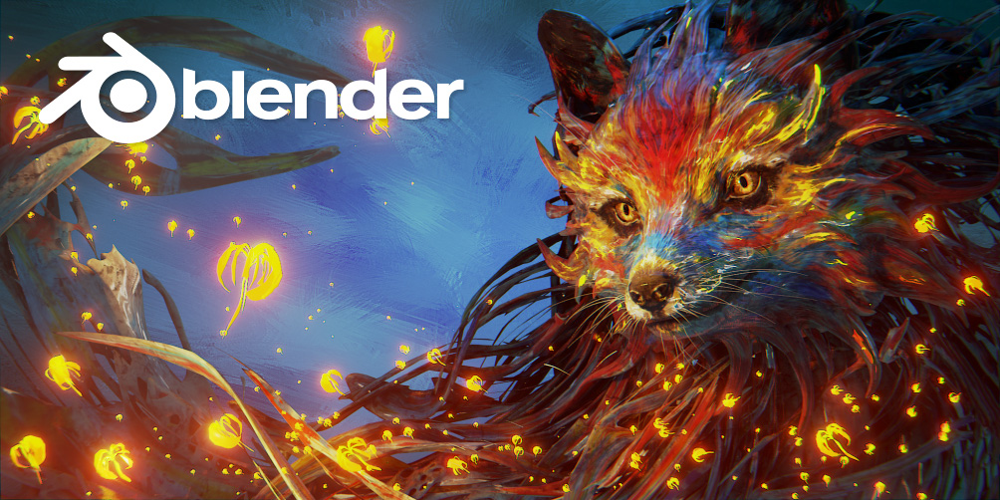
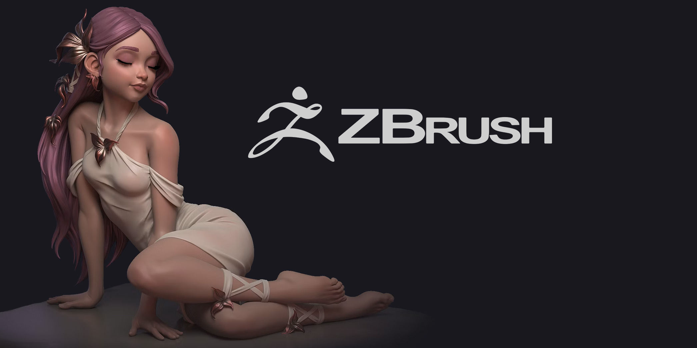
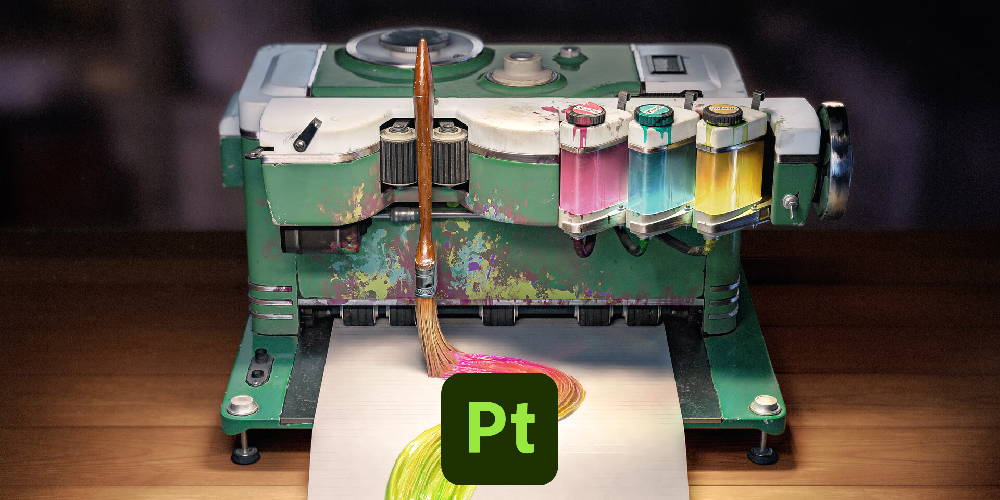
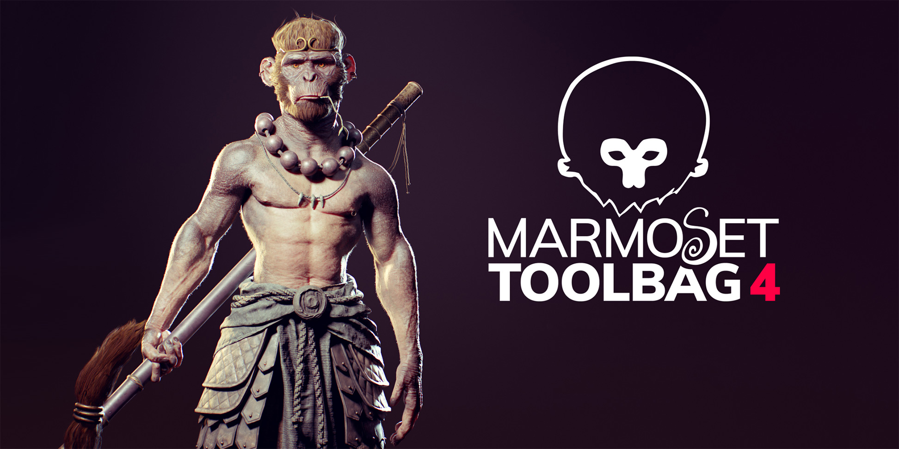
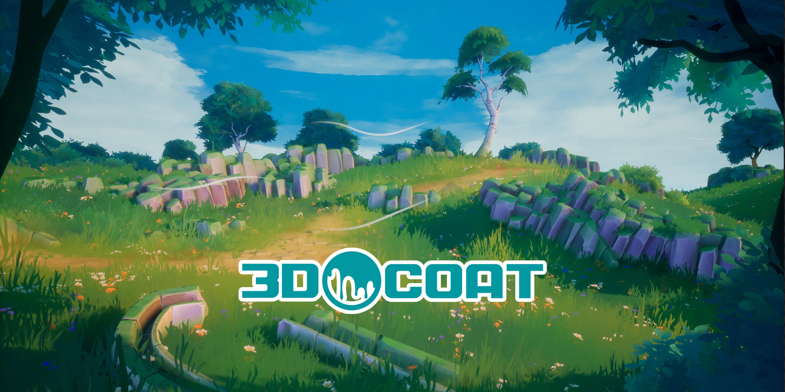
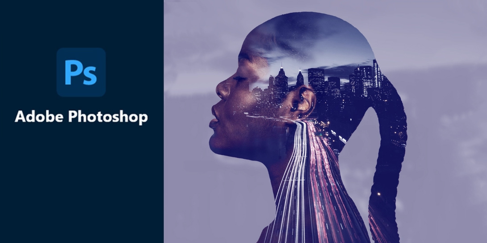

<h4 align="center">
  Portfolio
</h4>

 
 

3D Artist & Programmer currently studying `Tech Art` at [Digital Arts and Entertainment](https://www.digitalartsandentertainment.be/) (Howest University of Applied Sciences)

&nbsp;&nbsp; :bookmark_tabs: I'm also the author of the [3D Artist's Handbook](https://sidney-eliot.github.io/3d-artists-handbook) (which is currently on hold)

&nbsp;&nbsp; :keyboard: The main languages I use are: Python, Java & C++

&nbsp;&nbsp; :purple_heart: Other interests of mine include: Game design, Interface design (UX matters), Traditional art, Self-hosting stuff on my server and getting slapped in Souls-likes

&nbsp;&nbsp; 🧰 My daily drivers when creating 3D assest

|[Blender](https://www.blender.org/features)|[ZBrush](https://pixologic.com)|[**Substance Painter**](https://www.adobe.com/products/substance3d-painter.html)|[**Marmoset Toolbag**](https://marmoset.co/toolbag)
|:-:|:-:|:-:|:-:
||||
|[**3D Coat**](https://3dcoat.com)|[**Unreal Engine**](https://www.unrealengine.com/en-US/features)|[**Houdini**](https://www.sidefx.com/products/houdini/)|[**Photoshop**](https://www.adobe.com/products/photoshop.html)
||||

  
&nbsp;&nbsp; 📫 You can contact me through

||epicrex
|:-:|:-:
|<a href="https://www.artstation.com/sidney-eliot">|[sidney-eliot](https://www.artstation.com/sidney-eliot)

&nbsp;&nbsp; (English or German, either is fine)

🏳️‍⚧️🏳️‍🌈
<!---
<a href="https://open.spotify.com/user/t7ym2qcd6hh1l1clqey6soo5b?si=4726a1f73537412b">
Epicrex/Epicrex is a ✨ special ✨ repository because its `README.md` (this file) appears on your GitHub profile.
You can click the Preview link to take a look at your changes.
--->
