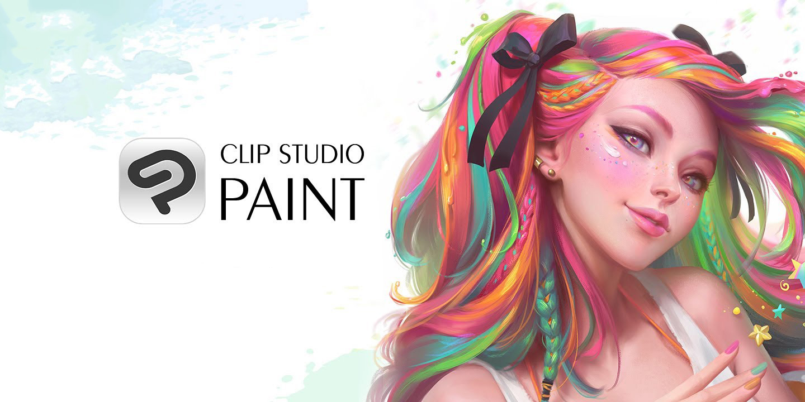

# 👋 Hi, I’m Sidney
- 💜 I’m a **3D Character Artist**, **Programmer** and am also interested in **Digital 2D Art**, **Photography** as well as **Game Design** and **Interface Design**, UX matters.  I'm also the author of the [3D Artist's Handbook](https://github.com/sidney-eliot/3d-artists-handbook/wiki).  
- 🧰 My 3D art software toolkit consists of:

|[Blender](https://www.blender.org/features)|[ZBrush](https://pixologic.com)|[**Substance Painter**](https://www.adobe.com/products/substance3d-painter.html)|[**Marmoset Toolbag**](https://marmoset.co/toolbag)
|:-:|:-:|:-:|:-:
||||
|[**3D Coat**](https://3dcoat.com)|[**Unreal Engine**](https://www.unrealengine.com/en-US/features)|[**Unity**](https://unity.com)|[**Photoshop**](https://www.adobe.com/products/photoshop.html)
||||
|[**Clip Studio Paint**](https://www.clipstudio.net/en)|[**Procreate**](https://procreate.com)||
||||

And of those **ZBrush** and **Blender** is where I spend most of my time.

- 🧰 I intend to expand my software toolkit with:

    |[Marvelous Designer](https://www.marvelousdesigner.com/)|[Maya](https://www.autodesk.com/products/maya)|[Cry Engine](https://www.cryengine.com)|[Fusion 360](https://www.autodesk.com/products/fusion-360)|[Mari](https://www.foundry.com/products/mari)|[Arnold](https://arnoldrenderer.com/)
    |:-:|:-:|:-:|:-:|:-:|:-:
    

- ⌨️ The programming languages I use are:
  |||
  |:-:|:-:|:-:|
  
- 🗣️ I can speak:

    |**`English`**|**native**
    |:-:|:-:
    |**`German`**|**native**
    |**`French`**|a bit
    |**`Japanese`**|learning

- 📫 You can reach me through:
    ||`epicrex`
    |:-:|:-:

 ---       
    
<a href="https://open.spotify.com/user/t7ym2qcd6hh1l1clqey6soo5b?si=4726a1f73537412b">    
<!---
Epicrex/Epicrex is a ✨ special ✨ repository because its `README.md` (this file) appears on your GitHub profile.
You can click the Preview link to take a look at your changes.
--->
